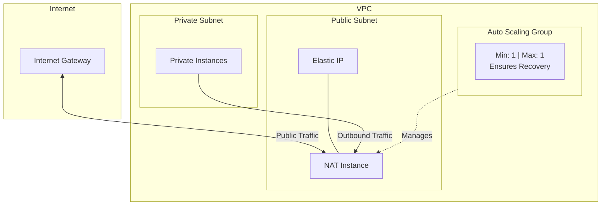

[](https://github.com/martoc/nat/actions)

# NAT Instance for AWS

A self-healing NAT (Network Address Translation) instance for AWS that automatically recovers from failures using Auto Scaling Groups.

## Overview

This CloudFormation template deploys a resilient NAT instance that enables resources in private subnets to access the internet while remaining inaccessible from outside. Unlike AWS NAT Gateway, this solution provides a cost-effective alternative with automatic recovery capabilities.

## Architecture



## Features

- **Auto-Recovery**: Auto Scaling Group ensures the NAT instance automatically restarts if it fails
- **Elastic IP Support**: Optionally associates a static public IP for consistent outbound addressing
- **Minimal IAM Permissions**: Follows the principle of least privilege
- **Automatic Route Configuration**: Updates route tables on instance startup
- **Cost-Effective**: Lower cost compared to AWS NAT Gateway for lower-throughput workloads

## Prerequisites

- An existing VPC with public and private subnets
- A route table for private subnets
- An AMI configured for NAT (e.g., Amazon Linux with IP forwarding enabled)
- (Optional) An Elastic IP with tags `Name=NAT` and `Type=instance` for static IP association

## Parameters

| Parameter | Description | Required | Default |
|-----------|-------------|----------|---------|
| `Name` | Name for resources (applied as tag) | Yes | - |
| `Version` | Version/revision of the stack | No | `1.0.0` |
| `Environment` | Stage/lifecycle (e.g., dev, staging, prod) | Yes | - |
| `ImageId` | AMI ID for the NAT instance | Yes | - |
| `InstanceType` | EC2 instance type | No | `t3.medium` |
| `VpcId` | VPC ID where resources will be deployed | Yes | - |
| `PublicSubnets` | List of public subnet IDs for the NAT instance | Yes | - |
| `RouteTableId` | Route table ID to update with NAT routes | Yes | - |

### Supported Instance Types

- `t3.small`, `t3.medium`, `t3.large`
- `m5.large`, `m5.xlarge`, `m5.2xlarge`

## Deployment

### Using AWS CLI

```bash
aws cloudformation create-stack \
  --stack-name my-nat-instance \
  --template-body file://nat.json \
  --capabilities CAPABILITY_IAM \
  --parameters \
    ParameterKey=Name,ParameterValue=my-nat \
    ParameterKey=Environment,ParameterValue=production \
    ParameterKey=ImageId,ParameterValue=ami-xxxxxxxxx \
    ParameterKey=VpcId,ParameterValue=vpc-xxxxxxxxx \
    ParameterKey=PublicSubnets,ParameterValue=subnet-xxxxxxxx \
    ParameterKey=RouteTableId,ParameterValue=rtb-xxxxxxxxx
```

### Using AWS Console

1. Navigate to CloudFormation in the AWS Console
2. Click "Create stack" > "With new resources"
3. Upload the `nat.json` template
4. Fill in the required parameters
5. Acknowledge IAM resource creation
6. Create the stack

## How It Works

### Instance Startup Process

When the NAT instance launches, it automatically:

1. **Disables Source/Destination Check**: Required for NAT functionality
2. **Updates Route Table**: Replaces the default route (0.0.0.0/0) to point to itself
3. **Associates Elastic IP**: If an Elastic IP tagged with `Name=NAT` and `Type=instance` exists, it gets associated

### Auto-Recovery Mechanism

The Auto Scaling Group maintains exactly one instance:
- **MinSize**: 1
- **MaxSize**: 1
- **Health Check**: EC2 (300-second grace period)

If the instance becomes unhealthy or terminates, the ASG automatically launches a replacement, which then configures itself using the startup script.

## Elastic IP Configuration

To use a static Elastic IP with this NAT instance:

1. Allocate an Elastic IP in your AWS account
2. Add the following tags to the Elastic IP:
   - `Name`: `NAT`
   - `Type`: `instance`
3. The NAT instance will automatically associate this IP on startup

## Security

### IAM Permissions

The NAT instance role has minimal permissions:
- `ec2:Describe*` - Read EC2 resources
- `ec2:ReplaceRoute` - Update route tables
- `ec2:ModifyInstanceAttribute` - Disable source/dest check
- `ec2:AssociateAddress` - Associate Elastic IP

### Security Group Rules

**Inbound:**
- TCP ports 1024-65535 from 0.0.0.0/0
- UDP ports 1024-65535 from 0.0.0.0/0

> **Note**: Consider restricting the CIDR range to your VPC CIDR for enhanced security.

## Cost Considerations

This NAT instance solution is more cost-effective than NAT Gateway for:
- Development/test environments
- Low-throughput workloads
- Scenarios where occasional brief outages during recovery are acceptable

**Cost comparison** (approximate, varies by region):
- NAT Gateway: ~$0.045/hour + $0.045/GB processed
- NAT Instance (t3.medium): ~$0.0416/hour (no per-GB charge)

## Limitations

- **Single AZ**: The instance runs in one availability zone at a time
- **Brief Downtime**: During instance replacement, there's a brief connectivity gap
- **Throughput**: Limited by instance type (vs NAT Gateway's 45 Gbps)
- **Management**: Requires AMI maintenance and updates

## Troubleshooting

### Instance not routing traffic

1. Verify the AMI has IP forwarding enabled (`net.ipv4.ip_forward = 1`)
2. Check that source/destination check is disabled on the instance
3. Verify the route table has been updated with the instance ID

### Elastic IP not associating

1. Ensure the Elastic IP has correct tags (`Name=NAT`, `Type=instance`)
2. Check IAM permissions for `ec2:AssociateAddress`
3. Review instance logs: `/var/log/cloud-init-output.log`

### Instance keeps terminating

1. Check the Auto Scaling Group activity history
2. Review instance system logs in EC2 console
3. Verify the AMI is valid and accessible

## Contributing

Contributions are welcome! Please feel free to submit a Pull Request.

## License

This project is open source. See the repository for license details.
